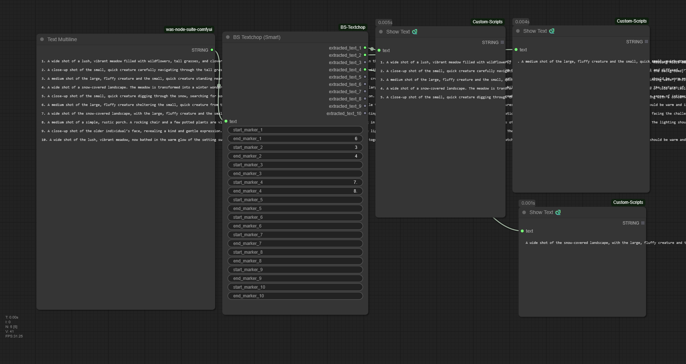

# ComfyUI-BS-Textchop

A custom node for ComfyUI that extracts text segments based on specified start and/or end marker strings. You can define multiple marker pairs to extract different segments from the same input text.

The node intelligently adapts its extraction based on whether you provide a start marker, an end marker, or both for each pair.

 <!-- Reference to the workflow image -->

## Features

*   **Multiple Extractions:** Define up to 10 pairs of start/end markers (`MAX_PAIRS` can be adjusted in the code).
*   **Automatic Activation:** A pair is processed if *either* its start marker or end marker field (or both) contains text. Pairs with both marker fields left empty are ignored.
*   **Smart Extraction Logic:**
    *   **Start and End Markers Provided:** Extracts text found *between* the first occurrence of the start marker and the first subsequent occurrence of the end marker.
    *   **Only Start Marker Provided:** Extracts all text *from* the position immediately after the first occurrence of the start marker *to the end* of the input text.
    *   **Only End Marker Provided:** Extracts all text *from the beginning* of the input text *up to* the first occurrence of the end marker.
*   **Individual Outputs:** Each potential marker pair corresponds to a unique output string (`extracted_text_1`, `extracted_text_2`, etc.). Outputs for inactive pairs or failed extractions will be empty strings.

## Installation

1.  **Navigate** to your ComfyUI `custom_nodes` directory:
    *   Example: `ComfyUI/custom_nodes/`
2.  **Clone this repository:**
    ```bash
    git clone https://github.com/YOUR_GITHUB_USERNAME/ComfyUI-BS-Textchop.git ComfyUI-BS-Textchop
    ```
    (Replace `YOUR_GITHUB_USERNAME` with your actual GitHub username). Make sure the destination folder name is `ComfyUI-BS-Textchop`.
    *   Alternatively, download the repository ZIP file and extract its contents into a folder named `ComfyUI-BS-Textchop` inside `custom_nodes`.
3.  **Restart ComfyUI:** Ensure ComfyUI is fully restarted to recognize the new node.

## Usage

1.  **Add Node:** Right-click on the ComfyUI canvas, go to `Add Node` -> `BS-Nodes` -> `Text`, and select `BS Textchop (Smart)`. (Or the name defined in your `__init__.py`).
2.  **Connect Inputs:**
    *   `text`: Connect the main string from which you want to extract text.
    *   `start_marker_1`, `end_marker_1`: Define the markers for the first extraction. Leave one empty for "from beginning" or "to end" extraction. Leave both empty to skip this pair.
    *   `start_marker_2`, `end_marker_2` (and so on): Define markers for subsequent pairs as needed.
3.  **Connect Outputs:**
    *   `extracted_text_1`: This output will contain the text extracted based on the markers provided for pair 1.
    *   `extracted_text_2`: Corresponds to the second marker pair.
    *   ...and so on, up to `extracted_text_10` (or `MAX_PAIRS`). Outputs corresponding to pairs where both markers were empty, or where the specified non-empty markers couldn't be found in the text, will be empty strings (`""`).

### Examples

Suppose you have the following input `text`:
File: report.txt [START] Important Data Section 1 [MID] More Data Section 2 [END] Final notes.

      
Here's how different marker combinations would work:

*   **Pair 1:**
    *   `start_marker_1`: `[START]`
    *   `end_marker_1`: `[MID]`
    *   `extracted_text_1`: ` Important Data Section 1 `

*   **Pair 2:**
    *   `start_marker_2`: `[MID]`
    *   `end_marker_2`: `[END]`
    *   `extracted_text_2`: ` More Data Section 2 `

*   **Pair 3:**
    *   `start_marker_3`: `[START]`
    *   `end_marker_3`: *(empty)*
    *   `extracted_text_3`: ` Important Data Section 1 [MID] More Data Section 2 [END] Final notes.`

*   **Pair 4:**
    *   `start_marker_4`: *(empty)*
    *   `end_marker_4`: `[MID]`
    *   `extracted_text_4`: `File: report.txt [START]`

*   **Pair 5:**
    *   `start_marker_5`: *(empty)*
    *   `end_marker_5`: *(empty)*
    *   `extracted_text_5`: `""` (empty string - pair inactive)

*   **Pair 6:**
    *   `start_marker_6`: `[NOT_FOUND]`
    *   `end_marker_6`: `[END]`
    *   `extracted_text_6`: `""` (empty string - start marker not found)

## Contributing

Feel free to fork the repository, make improvements, and submit pull requests.

## License

This project is licensed under the MIT License - see the [LICENSE](LICENSE) file for details.

    
